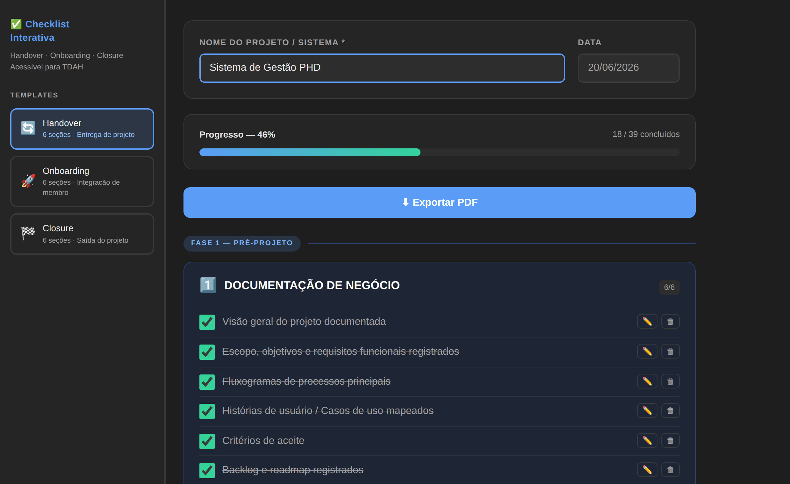
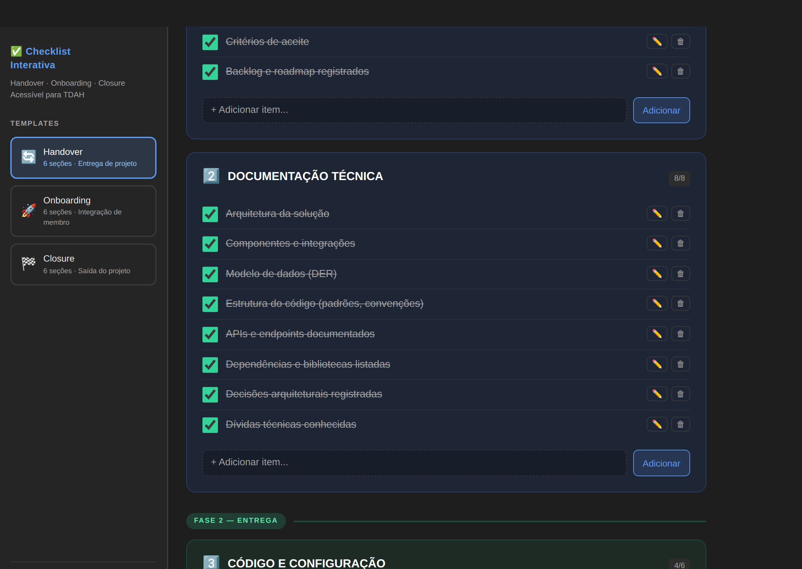
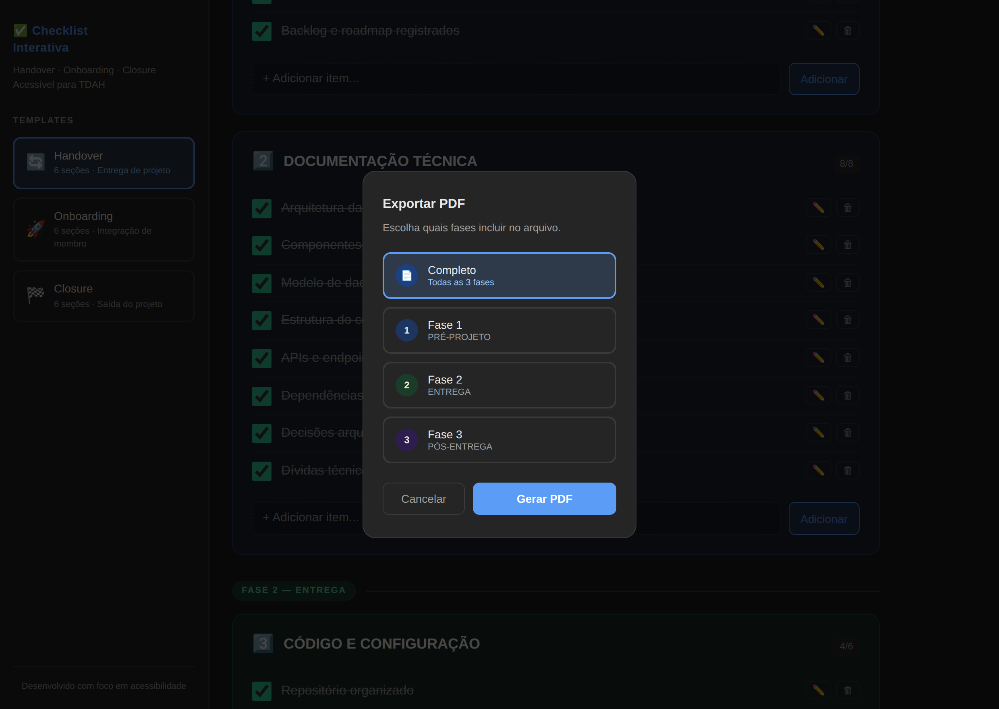

# Checklist Interativa — Handover, Onboarding & Closure

Uma ferramenta criada para organizar e acompanhar três momentos que costumam gerar retrabalho, perda de informação e dúvidas dentro de equipes: a transição de atividades, a entrada de novos integrantes e o encerramento de projetos.

A aplicação reúne checklists estruturadas que ajudam a garantir que informações importantes não sejam esquecidas durante esses processos, mantendo tudo registrado de forma simples, visual e organizada.

Além disso, a experiência foi pensada para facilitar a concentração e reduzir a sobrecarga de informações, especialmente para pessoas que preferem trabalhar com etapas curtas, objetivos claros e acompanhamento visual do progresso.

🔗 Acesse a ferramenta: https://tmr-botaut.github.io/Checks/

## Visão Geral

### Dashboard Principal



*Acompanhamento visual do progresso, fases do processo e itens concluídos.*

### Exemplo de Handover



*Checklist estruturada para transferência de conhecimento e responsabilidades.*

### Exportação de Relatórios



*Geração de relatórios organizados para registro e acompanhamento.*

## Por que criei esta ferramenta?

Em muitas equipes, a troca de responsáveis por um projeto, a chegada de novos colaboradores ou até mesmo o encerramento de uma iniciativa acontecem sem um processo estruturado.

O resultado costuma ser o mesmo: informações dispersas, documentos esquecidos, dúvidas recorrentes e perda de conhecimento.

Esta ferramenta surgiu para transformar esses momentos em processos mais organizados, previsíveis e fáceis de acompanhar.

## Quando utilizar

### Handover

Ideal para a transferência de um projeto, sistema ou atividade para outra pessoa ou equipe.

Ajuda a garantir que informações importantes sejam documentadas e compartilhadas antes da mudança de responsabilidade.

### Onboarding

Voltado para a integração de novos membros.

Permite acompanhar desde os acessos iniciais até o entendimento do contexto do projeto e das primeiras entregas.

### Closure

Utilizado no encerramento de projetos ou na saída de profissionais de uma equipe.

Auxilia na formalização das pendências, documentação final e repasse de responsabilidades.

Cada modelo possui etapas organizadas em sequência, facilitando o acompanhamento do que já foi concluído e do que ainda precisa ser tratado.

## Principais recursos

- Modelos prontos para Handover, Onboarding e Closure
- Mais de 100 itens de acompanhamento distribuídos entre diferentes etapas
- Barra de progresso atualizada automaticamente
- Contadores por seção para acompanhamento rápido
- Inclusão, edição e remoção de itens conforme a necessidade de cada projeto
- Salvamento automático das informações no navegador
- Exportação de relatórios em PDF
- Registro do nome do projeto e da data de execução
- Funciona em computador, tablet e celular
- Pode ser utilizada mesmo sem conexão após o carregamento inicial

## Experiência focada em acessibilidade

A interface foi construída com foco em clareza e simplicidade.

Entre os recursos adotados estão:

- Fonte de fácil leitura;
- Tema escuro com baixo desgaste visual;
- Divisão das atividades em etapas menores;
- Feedback visual imediato sobre o progresso;
- Organização por cores para facilitar a identificação das fases;
- Navegação simples e objetiva.

## Como utilizar

1. Escolha o modelo desejado: Handover, Onboarding ou Closure.
2. Informe o nome do projeto, sistema ou atividade.
3. Acompanhe as etapas marcando os itens concluídos.
4. Personalize os tópicos conforme a realidade da sua equipe.
5. Gere um relatório em PDF sempre que precisar registrar o andamento ou o encerramento das atividades.

## Relatórios em PDF

Os relatórios gerados pela ferramenta foram pensados para facilitar consultas futuras, auditorias internas, registro histórico e compartilhamento entre equipes.

O documento apresenta:

- Identificação do projeto;
- Data de emissão;
- Resumo do progresso;
- Itens concluídos e pendentes;
- Organização por etapas;
- Paginação automática.

## Estrutura do projeto

```
Checks/
├── index.html
├── README.md
└── screenshots/
```

## Sugestões de uso

- Transição entre analistas ou gestores;
- Mudança de fornecedor ou equipe responsável;
- Integração de novos colaboradores;
- Encerramento de projetos;
- Registro de conhecimento operacional;
- Controle de entregas e responsabilidades.

---

Projeto desenvolvido como iniciativa prática para apoiar processos de transição, documentação e gestão do conhecimento de forma simples, acessível e objetiva.
